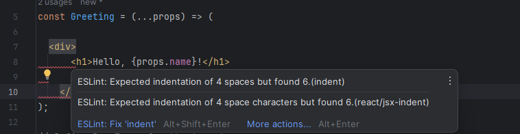
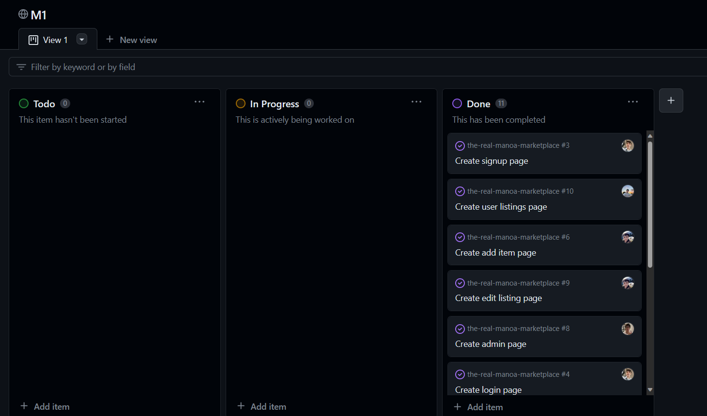

## What is software engineering?

While in university, learning about software engineering has been the most beneficial to my knowledge. In the past, I would learn about the quirks around object-oriented programming, or OOP for short. While this was alright, it wasn't necessarily what I wanted to know. I am glad for the knowledge gained in the past. However, I am most grateful for learning about software engineering.

The field of software is so large that when you take the broad term 'software engineering', it can relate to so many different things. Throughout this semester, I have learned many other aspects of software engineering. Just to name a few, we have functional programming, which is programming languages like JavaScript, design patterns, coding standards, etc. Now, let's go into detail on some of the important things I learned in the field of software engineering.

## Coding Standards

Coding Standards have played a pivotal role in my software engineering journey. It can be daunting when you have something like ESLint, a tool used in JavaScript development to enforce coding styles. When you're not familiar with coding standards, you may run into many different errors and red squiggly lines in your code. The culprit, of course, is ESLint. After some practice, you'll find that you get fewer and fewer red squiggly lines and more readable code. Coding standards can keep your codebase uniform, maintaining the same styles throughout; you can think of ESLint as a drill instructor. An example of ESLint in action can be seen below. 

ESLint tells you the error at hand and how you may be able to fix it. This is one of many uses of ESLint and you are able to configure ESLint to your liking by adding or removing the preset rules.

## User Interface Frameworks

If you're not a CSS guru like me, you'll find different User Interface frameworks, or UI for short, a godsend. If you don't like designing, it's pretty simple to build up a mockup using Bootstrap or React-Bootstrap. Utilizing these frameworks can make your time programming more enjoyable and efficient. Instead of figuring out random CSS rules and how to make things align, you can use one of these frameworks to do it quickly. While it is essential to know how to use CSS, if you're crunched for time or want to start coding functionalities for your project, UI frameworks can help. I found that UI frameworks allow me to easily create modern, eye-pleasing websites, allowing me to focus more on the complex backend and functionalities. When doing web design you can make the same design with CSS or any UI framework, but it will take you less time with a UI framework. Here is an example of a website I made using React-Bootstrap.

This website was made using React-Bootstrap, before learning React-Bootstrap, I learned to make the same website in Bvootstrap, and before that it was CSS. It was significantly faster for me to create the website with Bootstrap and React-Bootstrap. At the end of the day it doesn't matter what you use, but if you're crunched for time, UI frameworks can help you out.

## Project Management

In my time learning about software engineering, I finally worked with a team to develop an application. While it was difficult, one of the main factors in our success was our use of agile project management. In particular, IDPM or issue-driven project management. IDPM is usually used in smaller teams to create a good-quality web application. The clear guidelines allow you to work efficiently amongst your team members. As we developed our application, we needed to decompose our work into smaller tasks usually performed individually. These tasks should take around three days to finish, and each must be documented as a separate issue on GitHub. These issues or tasks will be done in its branch. With these guidelines, we could develop our app efficiently, where each department had its own task in development. If one of us needed help, hopping into the branch and trying to help was easy. It was also crucial as you can commit your progress without breaking your main branch. To document our progress, we used GitHub Projects to provide deliverables. After around a week or two, seeing your progress as a whole was important. In our case, we used three GitHub Projects to showcase our milestones. Within these projects were the issues that we were working on. Utilizing IDPM allowed us to work together effectively and create deliverable milestones within a given timeframe. Here is an example of GitHub Projects in use. 

This was taken from our recent project where we used IDPM. Each person in our group made issues that were able to be completed within three days, once you add it you can put the issue in the 'In Progress' tab, when you finish your issue and commit it to the main branch you can then move the issue to the 'done' tab. You can find more information about our project here, <a href="https://the-manoa-marketplace.github.io/uh-marketplace.github.io/">UH Marketplace</a>.

## Wrapping Up

All in all, these things I learned from software engineering were crucial to my learning. I can write good quality, uniform code by following coding standards, develop faster using UI frameworks, and have a great way to collaborate with a team using agile project management. While I learned many other things that will help me succeed as a developer, these are the key things I knew that I could use in my day-to-day life. Of course all aspects of software engineering are important in their own ways. Some people may have a different opinion on these things, but it’s important to learn this rather large field as much as you can to experience the way you like to do things.

