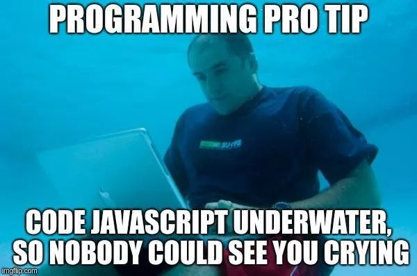

## JavaScript: Simple Yet Intricate

  Although JavaScript has its quirks, from a software engineering perspective I think JavaScript is a pretty good language. I mean it's used pretty much everywhere over the internet. The simplicity and syntax really make it shine over a language like Java for newbies thus allowing people to pick it up more easily. The functional programming style gives the user the ability to start coding almost instantly, there is no need to look up the dreaded main statement used in Java, there are no errors screaming at you because you forgot a semicolon. With that being said, you can’t expect to learn all of the intricacies of the language in a few days. Despite its simplicity compared to Java, I think it will take quite a while to master JavaScript. Even once you do that, you wouldn’t even be half way there with the addition of different JavaScript frameworks and other tools. 

## Enhancing Coding Skills Through Athletic Software Engineering

  JavaScript paired with the use of athletic software engineering in class, in my opinion is the perfect way to further one’s abilities in JavaScript or maybe any language for that matter. As the athletic software engineering approach is language agnostic you could use this style for a plethora of languages, such as Java to Python. Coding in a high stress environment is a sure way to better your coding skills and your ability to work under pressure. You never know the circumstances that you may be in in the future and athletic software engineering could possibly prepare one for those circumstances. You may find yourself at a hackathon or maybe even an interview where you are tasked with coding under pressure and the athletic software engineering teaching style will prepare you for these moments.

## Balancing Approaches: Fast-Paced Learning vs. Comprehensive Courses

  With all that being said, I think it’s cool to take this approach when learning JavaScript. When learning to code many people don’t get to learn in this way. It’s usually random youtube tutorial projects or online courses such as Udemy or maybe The Odin Project where you have months to learn how to code. But these approaches don't prepare you for the times where you have to code at a fast pace. If you happen to be someone wanting to work in a fast paced environment such as a startup or just doing a hackathon, not being able to work quickly can hinder your team and maybe your skills as a programmer. However, I wouldn’t say one style is better than the other. Both approaches are valid and it would be smart to utilize athletic software engineering and long courses that build upon your skills.

 
