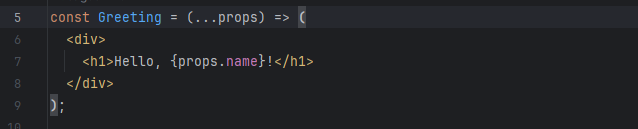
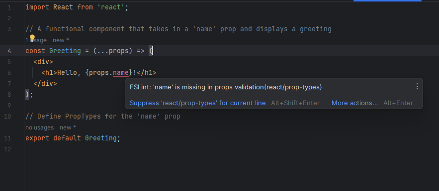
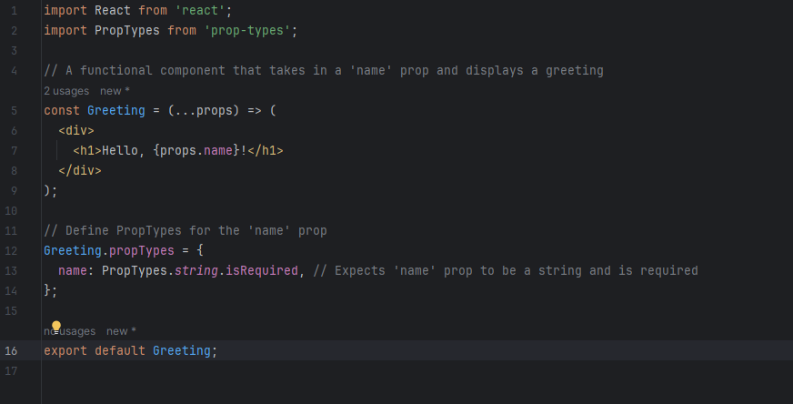

## The Difficulties of ESLint

At first, my opinion on ESLint was not that great. Going through the different intricacies of using IntelliJ and also setting up ESLint was not a great experience. Although it didn’t take longer than two hours, it still felt painful trying to get it all set up. The setup alone left a sour taste in my mouth. However, after going through the process and looking back, I think it would be very easy to set up now. With all that being said, I find ESLint very interesting to use; not only does it improve readability in my code, but it also helps me avoid potential bugs and syntax errors.

One of the primary reasons for my initial frustration with ESLint was the learning curve associated with it. As a developer, I was used to writing code in my own style, and suddenly being asked to adhere to a set of predefined coding rules was a bit jarring. Understanding how ESLint enforced these different rules was a challenge, especially when your editor is screaming at you in red every time you make a mistake. However, as I persevered and began to grasp the concept of ESLint rules and setting up the configuration files, I started to see the value in having a consistent code style across the project. It is clear to me what ESLint is trying to achieve and I think it's a very important tool to keep a code base uniform and readable.

## Some Examples

In order to fully understand what I’m writing about, it’s important to give some examples. Here are a few examples using ESLint, the code here is just a simple JavaScript react component that uses props to display a greeting to a user.

In this ESLint example, you can see that there are red lines showing that there are indentation errors. Some people are more iffy about their code and indentations, but some of the people I know don’t care to fix indentations or random spacing throughout their code. This can make it a little harder to read quickly. However, ESLint can fix that, you don’t even need to fix it manually, on the error ESLint asks if you want to fix the ‘indent’ error, pressing this will fix the error for you. Or you can hit ‘more actions’ and ESLint will give you the ability to fix the entire file with one click.

Now, lets see another area ESLint can make your code better, in this we will use the same example, but with prop validation. If you write using this code, ESLint will give you this error and give you two options, the first one is to suppress the error and it will go away, or you can add the prop types to fix it. Doing it this way is the correct way, but whichever one will work. In our fixed example, we added prop validation that defines the name prop. Name is a prop that should be a string and the isRequired makes it to where it is required for the component to be used.

## Why is it Important?

The usage of clear coding standards can really change a project, but more often than not coding standards get dismissed as minor details. Things like indentation or curly brace placement can affect readability and make things take longer than they should, with ESLint it’s a quick fix. However the usage of ESLint can take away personal preference, some may prefer a curly brace on a new line or using “” instead of ‘’. But it's hard to use that as an argument as you can configure ESLint to your liking by adding or removing the preset rules.

ESLint can be seen as a coding coach, trying to push you to be a better developer. The standards it pushes onto you can be very useful. It can make your future collaboration with other developers easier as less time will be spent trying to understand spaghetti code that doesn’t make sense. Imagine joining a project where you have non-informative variable names, different casing everywhere, little to no practical indents, and random spaces or newlines everywhere.
Going through the codebase would be very difficult in this situation. It’s almost like if you were to tYpE LiKe ThIS. Although you can understand it, it may look weird and may take you longer to read. Coding standards can be seen the same way and ESLint can force you to not make code like described above.  
