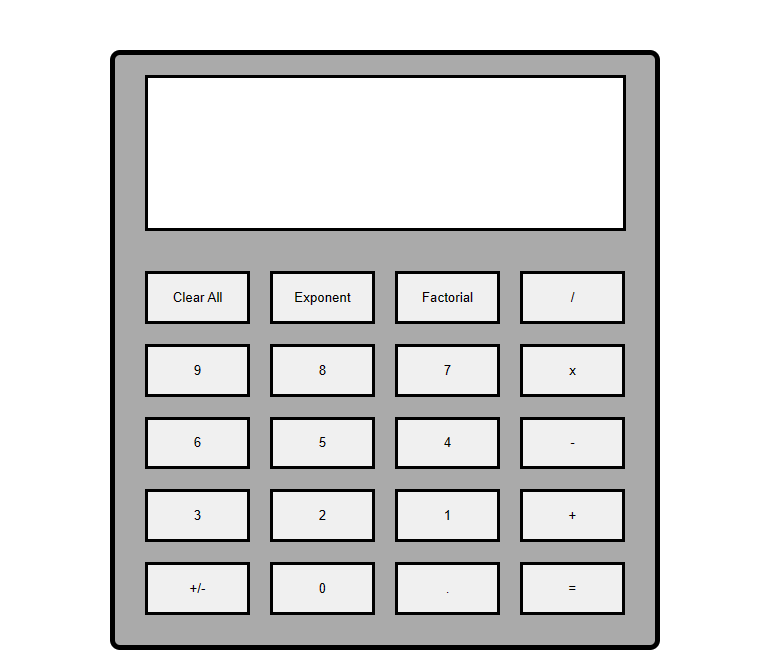

This calculator app is a project I built while doing The Odin Project. While its functionality may appear straightforward, the process of constructing it proved to be quite challenging. While creating the application, I found it difficult trying to store two seperate values for the different numbers you want to operate on. There were many different ways to do this but my knowledge at the time was not the best. 

In order to get the correct value when pressing a button I used the HTML data-type attribute to assign each button to it's corresponding number or operator.
```html
<button type="button" data-type="3" class="number" id="3">3</button>
<button type="button" data-type="2" class="number" id="2">2</button>
<button type="button" data-type="1" class="number" id="1">1</button>
<button type="button" data-type="+" class="operator" id="addition">+</button>
                
```
Here is an example of the data-type attribute. For the number buttons I stored the corresponding number for the button and for the operator buttons I stored the symbol, in this case the "+" symbol. 

To utilize these attributes I used the following javascript code
```javascript
for (const button of buttons) {
  button.addEventListener('click', () => {
    console.log(answerDisplay.textContent += button.getAttribute('data-type'));
  });
}
```
So, every time a button is pressed this event listener is called and it gets the buttons attribute. So, if you were to press the button for the number 5, it would get the string "5".
