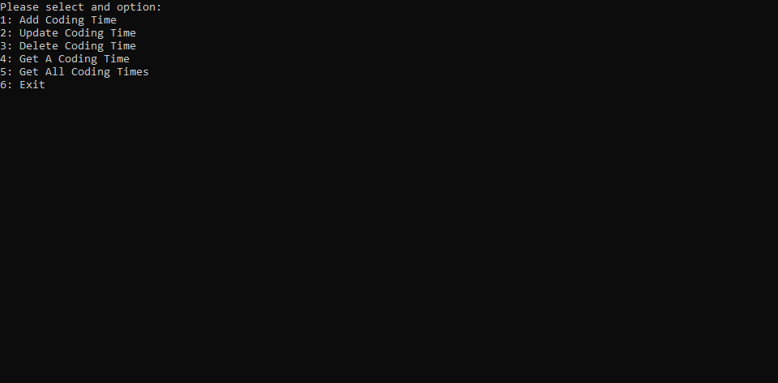
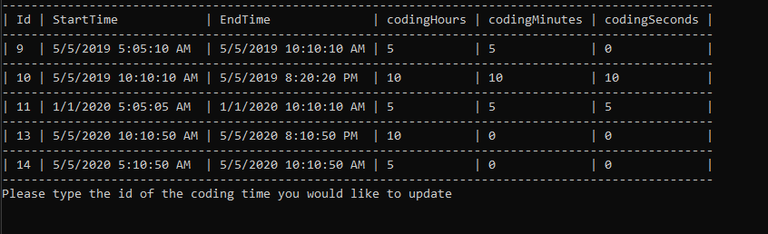

This coding tracker project is a CRUD console application developed using C# that allows the user to track how long they code for. Upon startup the application should check if you have a SQLite database initialized and if not, it will create one. When adding a coding time, the user will be prompted to add the date and the time they started and the time they finished. From there the application will automatically store the amount of time they coded for in a neat table. 

This simple project was created to learn the basics of C# and SQLite. Below are some images on what the application looks like.

  
  
  
  

To view the source code you can visit: https://github.com/hcazzz/CodingTracker
