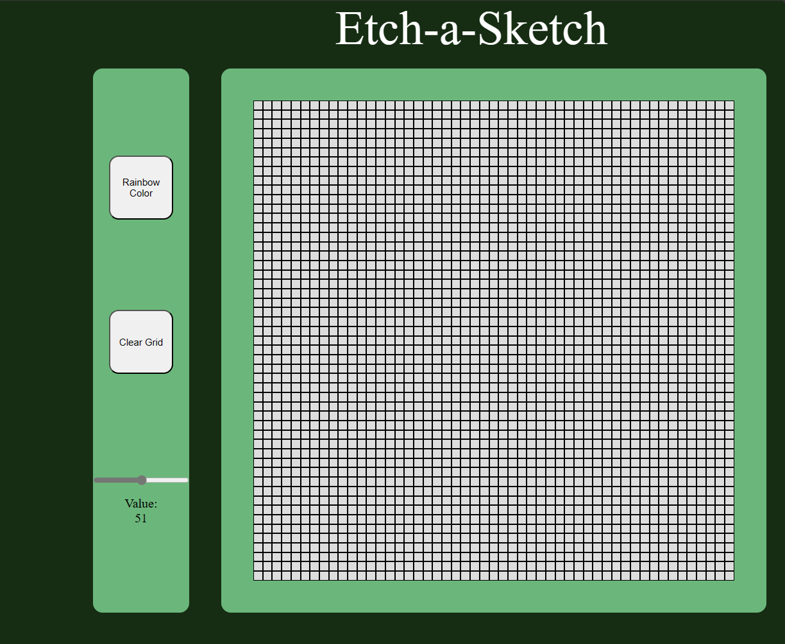

<div class="text-center p-4">
  
  
 
</div>

Etch-A-Sketch is a mechanical drawing toy where you twist two knobs, and you can make an image in black and white. This project was created to mimic a digital version of that game.

For this project, I utilized JavaScript, HTML and CSS to create Etch-A-Sketch. The project is capable of creating a grid up to 100x100 and allows you to draw using your mouse. You are able to clear the grid and also change the color to be rainbow which utilizes a random color generator to do so. As you hover over a grid with your mouse the grid will change color to either black or a random color.


Here is some code that illustrates how I received a random color.

```javascript
function getRandomColor() {
    const availableCharacters = '0123456789ABCDEF';
    const availableCharactersLength = availableCharacters.length;
    let color = '#';

    for (let i = 0; i < 6; i++) {
        color += availableCharacters[Math.floor(Math.random() * availableCharactersLength)];
    }

    return color;
}

```


To do this I used hex color codes which is the # sign and 6 random digits following. 
The function takes a string of the possible color values and randomly 
generates random characters from the string to create the 6 digit hex color code.

<!DOCTYPE html>
<html lang="en">
<head>
  <meta charset="UTF-8">
  <meta name="viewport" content="width=device-width, initial-scale=1.0">
  <title>Random Color Button</title>
  <style>
    :root {
      --dark-background: #282c34;
      --light-text: #abb2bf;
      --code-text: #abb2bf; /* Color for code text */
      --button-bg: #61afef;
      --button-text: #abb2bf;
    }

    body {
      background-color: var(--dark-background);
      color: var(--light-text);
      font-family: Arial, sans-serif;
      display: flex;
      justify-content: center;
      align-items: center;
      height: 100vh;
      margin: 0;
    }

    code {
      color: var(--code-text);
    }

    button {
      background-color: var(--button-bg);
      color: var(--button-text);
      border: none;
      padding: 10px 20px;
      border-radius: 5px;
      cursor: pointer;
      font-size: 16px;
    }

    button:hover {
      background-color: darken(var(--button-bg), 10%);
    }
  </style>
</head>
<body>
  <button id="colorButton">Get Random Color</button>
  <code>
    function getRandomColor() {
      const availableCharacters = '0123456789ABCDEF';
      const availableCharactersLength = availableCharacters.length;
      let color = '#';

      for (let i = 0; i < 6; i++) {
          color += availableCharacters[Math.floor(Math.random() * availableCharactersLength)];
      }

      return color;
    }
  </code>
</body>
</html>

