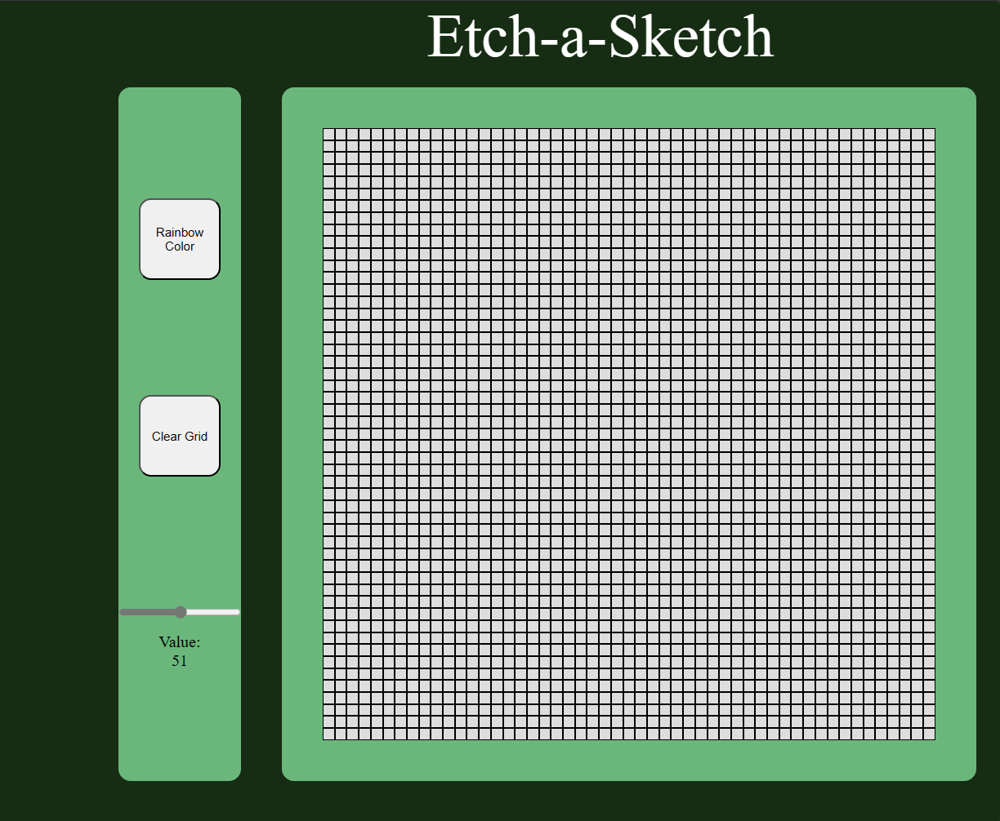

<div class="text-center p-4">
  
  
 
</div>

Etch-A-Sketch is a mechanical drawing toy where you twist two knobs and you can make an image in black and white. This project was created to mimic a digital version of that game.

For this project, I utilized Javascript, HTML and CSS to create Etch-A-Sketch. The project is capable of creating a grid up to 100x100 and allows you to draw using your mouse. You are able to clear the grid and also change the color to be rainbow which utilizes a random color generator to do so. As you hover over a grid with your mouse the grid will change color to either black or a random color.


Here is some code that illustrates how I recieved a random color.

```javascript
function getRandomColor() {
    const availableCharacters = '0123456789ABCDEF';
    const availableCharactersLength = availableCharacters.length;
    let color = '#';

    for (let i = 0; i < 6; i++) {
        color += availableCharacters[Math.floor(Math.random() * availableCharactersLength)];
    }

    return color;
}

```
To do this I used hex color codes which is the # sign and 6 random digits following. 
The function takes a string of the possible color values and randomly 
generates random characters from the string to create the 6 digit hex color code.

You can learn more at the [UH Micromouse News Announcement](https://manoa.hawaii.edu/news/article.php?aId=2857).
