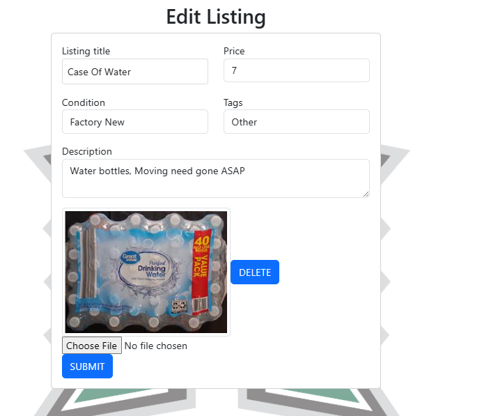

<div class="text-center p-4">
  


</div>

<a href="https://the-manoa-marketplace.github.io/uh-marketplace.github.io/">UH Marketplace</a> was the final project I helped create in <a href="https://courses.ics.hawaii.edu/ics314f23/">ICS 314</a>. I worked with 4 others to create this project, which allows people from the University of Hawaii system to create an account and buy and sell items. 

The project was created using Meteor, MongoDB, React, and Bootstrap. We used Meteor to create the application, MongoDB to store the data, React to create the front end, and Bootstrap to make the website look nice. The project used agile project management to create deliverables and milestones. We used GitHub projects to create milestones and issues to work on. We used ESLint to enforce coding standards and used GitHub to store our code.

The most notable things I worked on in this project is the create and edit listing pages, and the database scheme. The create listing page was created using react-bootstrap forms and allows the user to add images, which was the hardest part. Here is an example of the add listing page.

<div class="text-center p-4">
  
</div>

The add listing page allows the user to multiple images and delete them. In order to add images and retrieve them from the database I had to utilize cloudinary to store the images and retrieve them. I also had to create a database scheme to store the images in the database. Here is the code that handled uploading images to the cloudinary endpoint.

```javascript
import axios from 'axios';

const postImage = async (imagefile) => {
  try {
    const formData = new FormData();
    formData.append('file', imagefile);
    formData.append('upload_preset', 'PRESET');

    const response = await axios.post('https://api.cloudinary.com/v1_1/KEY/image/upload', formData);
    const data = response.data.secure_url;
    console.log('data from postImage():', data);
    return data;
  } catch (error) {
    console.log(error);
    return null;
  }
};

export default { postImage };
```
It was quite difficult to come to this point as I had to learn how to use cloudinary to upload images. In order to correctly do create the page I had to make sure the user could see the images they upload and they were able to delete them. As I had to deal with state I used the React useState to do this. In this code block it shows the handleImageDelete function which deletes the image from the state and the handleImagePreview function which adds the image to the state, it also shows the submit function which uploads the images to the cloudinary endpoint and stores the url in the database.

```javascript
const AddListing = () => {
  const [imagesSelected, setImagesSelected] = useState([]);
  const handleImageDelete = (index) => {
    setImagesSelected(imagesSelected.filter((_, i) => i !== index));
  };

  const handleImagePreview = (selectedFiles) => {
    setImagesSelected(selectedFiles);
  };

  const submit = async (data) => {
    const { listingTitle, price, condition, description, tags } = data;
    let images = [];
    if (imagesSelected.length > 0) {
      images = await Promise.all(
        imagesSelected.map((image) => CloudinaryUpload.postImage(image)),
      );
    }
    const owner = Meteor.user().username;
```

It was also important to only upload images to the cloudinary endpoint when the user submits the form. This was done by using the submit function which is called when the user clicks the submit button. This was important as it would be a waste of resources to upload images to the cloudinary endpoint if the user decides to not submit the form.

The edit listing page was created in a similar manner, but I had to be able to retrieve the images from the database and display them. Here is an example of the edit listing page.

<div class="text-center p-4">
  
</div>

Here is a small code block I used to display the images from the database.

```javascript
images.map((url, index) => (
    div key={index}>
        <Image src={url} thumbnail />
        <Button onClick={() => handleImageDelete(index)}>Delete</Button>
</div>
))}
```

The images were retrieved from this segment of code, if the listing had no images then no images would be displayed however the user was still free to add images to the listing.

```javascript
    const document = Listings.collection.findOne(_id);
    return {
      doc: document,
      ready: rdy,
    };
  }, [_id]);

  const [images, setImages] = useState(doc.images || []);
```

Besides the create and edit listing pages, I also worked on the database scheme. I created the database scheme using the SimpleSchema package. Here is an example of the database scheme I created.

```javascript
import { Mongo } from 'meteor/mongo';
import SimpleSchema from 'simpl-schema';

/**
 * The ListingsCollection. It encapsulates state and variable values for listing.
 */
class ListingsCollection {
  constructor() {
    // The name of this collection.
    this.name = 'ListingsCollection';
    // Define the Mongo collection.
    this.collection = new Mongo.Collection(this.name);
    // Define the structure of each document in the collection.
    this.schema = new SimpleSchema({
      listingTitle: String,
      price: Number,
      owner: String,
      description: String,
      condition: {
        type: String,
        allowedValues: ['Factory New', 'Like New', 'Fair', 'Field-Tested'],
      },
      tags: {
        type: String,
        allowedValues: ['Apparel', 'Housewares', 'Vehicle', 'Electronics', 'Games', 'Other'],
      },
      images: {
        type: Array,
        optional: true,
      },
      'images.$': {
        type: String,
        optional: true,
      },
    });
    // Attach the schema to the collection, so all attempts to insert a document are checked against schema.
    this.collection.attachSchema(this.schema);
    // Define names for publications and subscriptions
    this.userPublicationName = `${this.name}.publication.user`;
    this.adminPublicationName = `${this.name}.publication.admin`;
    this.listingPublicationName = `${this.name}.publication.listing`;
  }
}

/**
 * The singleton instance of the StuffsCollection.
 * @type {ListingsCollection}
 */
export const Listings = new ListingsCollection();
```

While this wasn't very difficult to do, it was important to do it correctly as it would be used throughout the project. Besides these things I was also in charge of deploying the site to digital ocean and setting up the domain name. Other than that I played a role in helping my group members with whatever errors they may have had and making sure all ESLint errors that weren't fixed were fixed. 

Once again if you'd like to visit our project you can do so here <a href="https://the-manoa-marketplace.github.io/uh-marketplace.github.io/">UH Marketplace</a>.